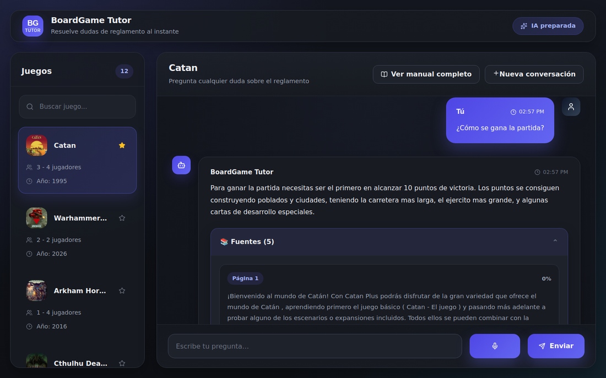

# BoardGame Tutor — Backend

[](https://github.com/AdrianMnd/boardgame-tutor-backend/actions/workflows/ci.yml)

🔗 **[Ver la aplicación en vivo](https://boardgametutor.vercel.app)** (este repositorio es la API — la interfaz está en el [repositorio del frontend](https://github.com/AdrianMnd/boardgame-tutor-frontend))

API REST en Node.js/Express para **BoardGame Tutor**, una aplicación de preguntas y respuestas sobre reglamentos de juegos de mesa mediante RAG (*Retrieval-Augmented Generation*): el usuario pregunta en lenguaje natural, la API recupera los fragmentos más relevantes del PDF del reglamento y genera una respuesta citando las páginas exactas usadas como fuente.



## Características

- **RAG completo**: extracción de PDF → *chunking* → embeddings → búsqueda por similitud coseno → generación de respuesta con contexto.
- **Streaming de respuestas** (Server-Sent Events): el texto aparece progresivamente en vez de esperar a la respuesta completa.
- **6 proveedores de IA soportados** (Gemini, OpenRouter, Mistral, OpenAI, DeepInfra, Together) con *fallback* automático ante fallos de cuota — y también un modelo de embeddings local (`transformers.js`) sin dependencias externas.
- **Consistencia de embeddings garantizada por diseño**: a diferencia del chat (donde varios proveedores son intercambiables), los embeddings usan siempre un único proveedor fijo — mezclar proveedores distintos rompería la búsqueda por similitud, así que el sistema se niega a arrancar si no está configurado de forma inequívoca.
- **Cuentas de usuario** (JWT, contraseñas con `bcrypt`): registro, login, edición de perfil (nombre/email/contraseña, cada uno con su propia validación).
- **Favoritos y categorías personalizadas** por cuenta — sincronizados entre dispositivos si hay sesión iniciada; el frontend sigue funcionando igual sin cuenta, guardando solo en local.
- **Historial de conversación por (usuario, juego)**, sincronizado con la cuenta — una conversación activa por juego, igual que ya funcionaba en local.
- **Solicitud de juegos nuevos**: cualquier usuario registrado puede proponer un juego con enlace a BoardGameGeek y PDF del reglamento (opcional); los PDF se suben a Backblaze B2 y llega un correo (Resend) con enlaces de descarga temporales para revisarlos.
- **Importación de juegos resiliente**: *checkpoints* para reanudar una importación interrumpida por cuota agotada, embeddings en lote (menos peticiones HTTP), y verificación automática de que no queden fragmentos con embeddings incompletos o inconsistentes.
- **Rate limiting** por IP, con límites distintos según el coste real de cada endpoint (preguntas de chat, intentos de login, solicitudes de juegos con archivos).
- Arquitectura por capas (dominio / aplicación / infraestructura / presentación), con inyección de dependencias manual.
- **91 tests unitarios** (Vitest) — repositorios, casos de uso y controladores, todos con dependencias externas simuladas (nunca tocan Postgres/B2/IA de verdad).

## Almacenamiento

Todo el estado de la aplicación vive en dos servicios externos, ambos con capa gratuita:

- **[Neon](https://neon.tech)** (Postgres + `pgvector`): juegos, documentos, fragmentos con sus embeddings, usuarios, favoritos, categorías, conversaciones.
- **[Backblaze B2](https://www.backblaze.com/cloud-storage)** (compatible con la API de S3, bucket privado): los PDF de los reglamentos y las portadas de los juegos.

No hay ningún dato de la aplicación en el propio sistema de archivos del servidor — el backend es completamente sin estado (*stateless*), lo que permite desplegarlo en un plan gratuito de hosting sin preocuparse de que el disco se resetee entre despliegues.

## Arquitectura

```text
┌───────────────────────────────┐
│ React + Vite                  │
│ Frontend                      │
└───────────────┬───────────────┘
                │ HTTP/JSON + SSE
                ▼
┌───────────────────────────────┐
│ Node.js + Express              │
│ Backend (este repositorio)     │
│                                 │
│ presentation/  → rutas, HTTP   │
│ application/   → casos de uso  │
│ domain/        → reglas puras  │
│ infrastructure/→ Postgres, B2, │
│                  IA, email     │
└───────┬───────────────┬───────┘
        │               │
        ▼               ▼
┌───────────────┐ ┌───────────────┐
│ Neon           │ │ Backblaze B2  │
│ (Postgres +    │ │ (PDF y        │
│  pgvector)     │ │  portadas)    │
└───────────────┘ └───────────────┘
```

`domain` no importa nada de las otras capas: define interfaces (`IGameRepository`, `IEmbeddingProvider`, `IFileStorage`, `IUserRepository`...) que `infrastructure` implementa. `application` orquesta casos de uso combinando piezas de `domain` e `infrastructure`. Ver [`docs/ARCHITECTURE.md`](docs/ARCHITECTURE.md) para el detalle completo.

## Endpoints principales

```text
GET    /api/games                          Lista de juegos
GET    /api/games/:id/cover                Portada del juego
GET    /api/games/:id/manual               PDF del reglamento

POST   /api/chat                           Pregunta (respuesta completa)
POST   /api/chat/stream                    Pregunta (streaming, SSE)

POST   /api/auth/register                  Crear cuenta
POST   /api/auth/login                     Iniciar sesión
GET    /api/auth/me                        Datos de la cuenta actual
PATCH  /api/auth/me                        Cambiar nombre
PATCH  /api/auth/me/email                  Cambiar email (pide contraseña actual)
PATCH  /api/auth/me/password                Cambiar contraseña (pide la actual)

GET    /api/favorites                      Favoritos de la cuenta
POST   /api/favorites/:gameId              Marcar como favorito
DELETE /api/favorites/:gameId              Quitar de favoritos

GET    /api/categories                     Categorías de la cuenta
POST   /api/categories                     Crear categoría
PATCH  /api/categories/:id                 Renombrar categoría
DELETE /api/categories/:id                 Borrar categoría
POST   /api/categories/:id/games/:gameId    Añadir un juego a la categoría
DELETE /api/categories/:id/games/:gameId    Quitar un juego de la categoría

GET    /api/conversations/:gameId          Conversación guardada de ese juego
POST   /api/conversations/:gameId/messages  Añadir un mensaje
DELETE /api/conversations/:gameId          Borrar la conversación ("Nueva conversación")

POST   /api/game-requests                  Solicitar un juego nuevo (con sesión)
```

Todos los de `/api/favorites`, `/api/categories`, `/api/conversations` y `/api/game-requests` requieren sesión (cabecera `Authorization: Bearer <token>`). Referencia completa, con formato de peticiones/respuestas y el protocolo SSE, en [`docs/API.md`](docs/API.md).

## Tecnologías

- Node.js + TypeScript, Express 5
- Postgres (Neon) + `pgvector`, vía el driver `pg`
- Backblaze B2 vía `@aws-sdk/client-s3` (compatible con S3) + `@aws-sdk/s3-request-presigner` (enlaces de descarga firmados)
- `bcrypt` + JWT (`jsonwebtoken`) para autenticación
- `resend` para el correo de solicitud de juegos
- `multer` para la subida de archivos (`multipart/form-data`)
- `@google/genai` (Gemini) y clientes propios para el resto de proveedores de IA
- `@huggingface/transformers` (embeddings locales, opcional)
- `pdf2json`, `express-rate-limit`
- Vitest

## Puesta en marcha local

```bash
npm install
cp .env.example .env
# Rellena .env — ver la sección siguiente para lo mínimo imprescindible
npm run dev
```

El servidor arranca en el puerto definido por `PORT` (por defecto `3000`).

### Lo mínimo imprescindible en `.env`

- `DATABASE_URL` — cadena de conexión de un proyecto Neon, con `db/schema.sql` ya aplicado (pégalo en el "SQL Editor" del panel de Neon).
- `B2_ENDPOINT`, `B2_BUCKET`, `B2_ACCESS_KEY_ID`, `B2_SECRET_ACCESS_KEY` — credenciales de un bucket privado de Backblaze B2.
- `JWT_SECRET` — cualquier cadena aleatoria de 32+ caracteres (`node -e "console.log(require('crypto').randomBytes(32).toString('hex'))"`).
- `AI_EMBEDDING_PROVIDER` y al menos una API key del proveedor de IA correspondiente.
- `RESEND_API_KEY` y `NOTIFICATION_EMAIL` — solo si quieres probar la solicitud de juegos nuevos; el resto de la app funciona sin ellos.

Detalle completo de cada variable, con el porqué, en [`docs/CONFIGURATION.md`](docs/CONFIGURATION.md).

## Scripts

```bash
npm run dev              # servidor en desarrollo (hot reload)
npm run build             # compilar TypeScript
npm start                 # ejecutar la build compilada
npm run import <gameId>   # importar un juego (PDF → embeddings → Postgres + B2)
npm run fetch-bgg <id> <bgg>  # rellenar metadata.json desde BoardGameGeek (opcional)
npm run ask <gameId> <p>  # preguntar desde la CLI, sin pasar por HTTP
npm run check:embeddings  # detectar juegos con embeddings dañados/inconsistentes
npm test                  # tests (Vitest)
npm run test:coverage     # tests con cobertura
```

Comandos de prueba individuales por proveedor de IA: `test:gemini`, `test:openrouter`, `test:mistral`, `test:openai`, `test:deepinfra`, `test:together`, `test:local-embedding`.

## Seguridad

- Ninguna clave de API, credencial de B2 ni `JWT_SECRET` se sube nunca al repositorio (`.env` está en `.gitignore`).
- Contraseñas nunca se guardan en texto plano — solo su hash (`bcrypt`, 12 rondas).
- Cambiar el email o la contraseña de una cuenta exige confirmar la contraseña actual, incluso con una sesión ya iniciada.
- El bucket de B2 es privado — el acceso a los PDF (reglamentos y solicitudes pendientes de revisar) siempre pasa por el backend o por enlaces firmados con caducidad, nunca por una URL pública fija.
- Rate limiting específico por endpoint según su coste real (`CHAT_RATE_LIMIT`, `AUTH_RATE_LIMIT`, `GAME_REQUEST_RATE_LIMIT`).
- CORS restringido a orígenes explícitos (`FRONTEND_URL` para desarrollo local, más el dominio de producción).

## Limitaciones conocidas

- `npm audit` reporta 4 vulnerabilidades de severidad alta, todas en dependencias transitivas de `@huggingface/transformers` (el motor de embeddings locales, opcional) sin parche disponible todavía por parte de sus mantenedores. No afectan si no activas `LOCAL_EMBEDDING_ENABLED`.
- La solicitud de juegos nuevos solo manda correo a la cuenta propia (`NOTIFICATION_EMAIL`) — sin un dominio propio verificado en Resend, no es posible mandar de forma fiable un correo de confirmación a quien hace la solicitud. Ver [`docs/CONFIGURATION.md`](docs/CONFIGURATION.md).

## Licencia

ISC — ver [LICENSE](./LICENSE).

## Más documentación

- [`docs/ARCHITECTURE.md`](docs/ARCHITECTURE.md) — arquitectura por capas, el pipeline RAG, el sistema de proveedores de IA, autenticación.
- [`docs/API.md`](docs/API.md) — referencia completa de endpoints, incluido el protocolo SSE.
- [`docs/CONFIGURATION.md`](docs/CONFIGURATION.md) — variables de entorno, despliegue, cómo importar un juego nuevo.
- [`docs/AI.md`](docs/AI.md) — cada proveedor de IA soportado, sus modelos por defecto y el sistema de *fallback*.
- [`docs/RAG.md`](docs/RAG.md) — el pipeline de *retrieval* en detalle: *chunking*, embeddings, búsqueda semántica, *reranking*.
- [`docs/DEVELOPMENT.md`](docs/DEVELOPMENT.md) — flujo de trabajo en local, cómo correr los tests.
- [`docs/DEPLOYMENT.md`](docs/DEPLOYMENT.md) — cómo está desplegado en producción (Render + Neon + B2 + Resend).
- [`docs/TROUBLESHOOTING.md`](docs/TROUBLESHOOTING.md) — problemas frecuentes y cómo diagnosticarlos.
- [`docs/ENGINEERING-NOTES.md`](docs/ENGINEERING-NOTES.md) — problemas reales de producción encontrados y resueltos durante el desarrollo.
